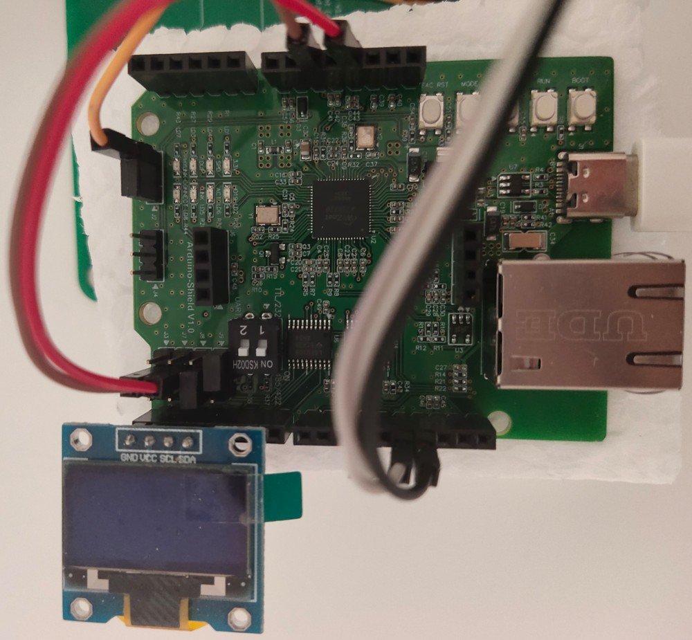
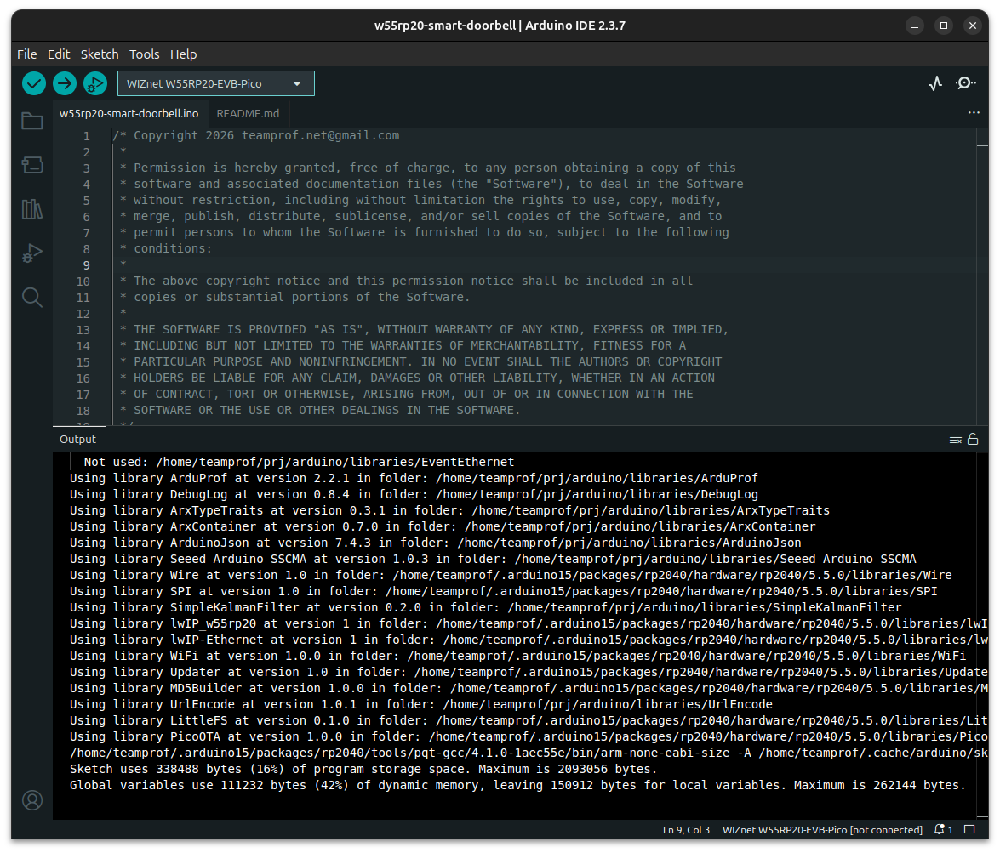
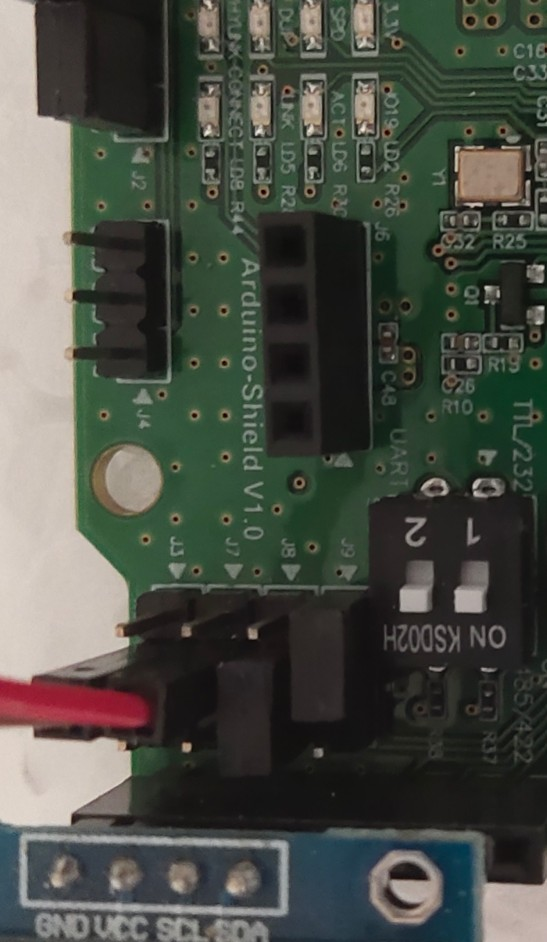
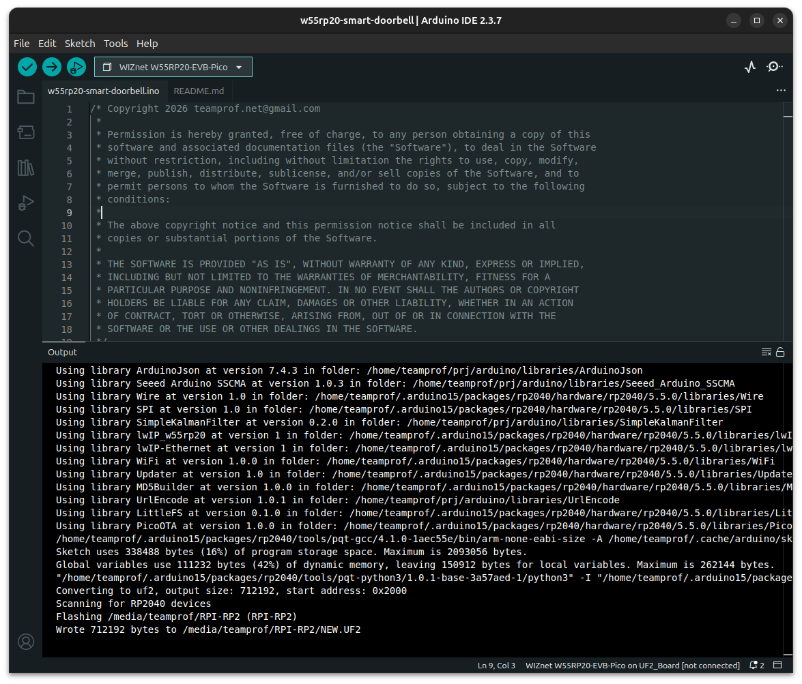
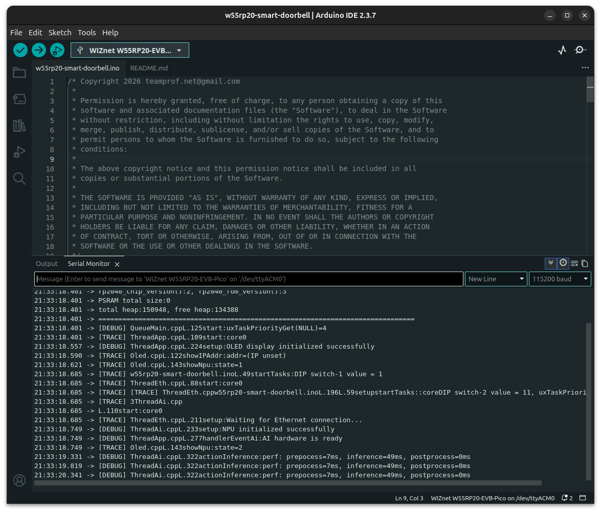
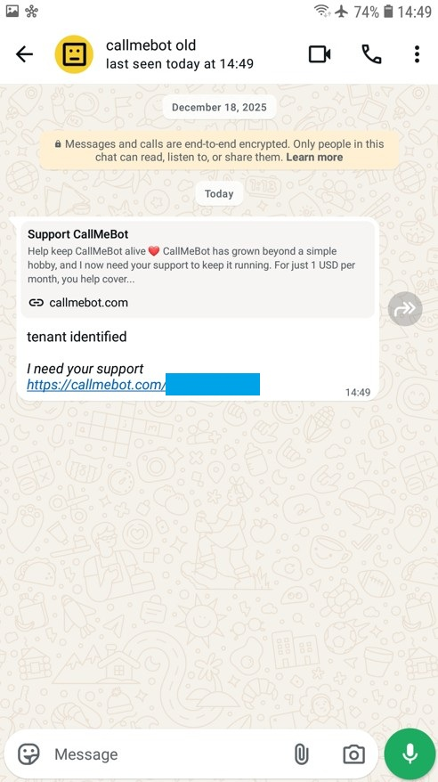
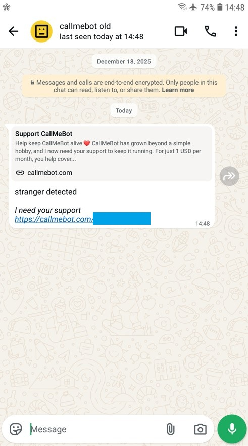
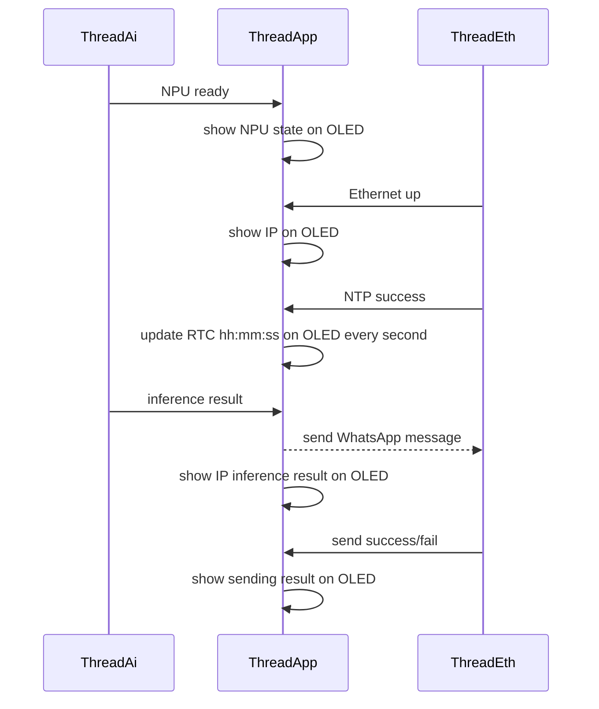
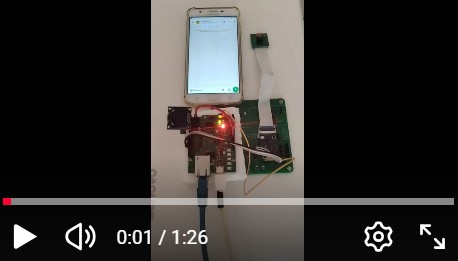

# W55RP20 Smart Doorbell
The W55RP20 smart doorbell proof-of-concept integrates the W55RP20-Arduino platform with the Seeed Studio Grove AI Vision V2 module to deliver intelligent tenant recognition and real-time notifications. The Grove AI Vision V2 performs on-device image classification, distinguishing between known tenants and strangers at the door. Once classification is complete, the W55RP20-Arduino acts as the communication gateway, triggering a secure message dispatch. Through its Ethernet interface, the W55RP20 sends a WhatsApp notification directly to the user’s mobile device, ensuring immediate awareness of visitor identity. This modular design demonstrates a scalable approach to combining embedded vision and IoT messaging for smart home security.

[](https://github.com/teamprof/w55rp20-smart-doorbell/blob/main/LICENSE)

<a href="https://www.buymeacoffee.com/teamprof" target="_blank"></a>

## System diagram
[](https://github.com/teamprof/w55rp20-smart-doorbell/blob/main/assetd/sys-diagram.jpg)

## Demo photo
[](https://github.com/teamprof/w55rp20-smart-doorbell/blob/main/assetd/demo-photo.jpg)

## Hardware 
### Components
- [W55RP20-arduino](https://docs.wiznet.io/Product/Chip/MCU/W55RP20/w55rp20-arduino)
- [Grove Vision AI Module V2](https://wiki.seeedstudio.com/grove_vision_ai_v2/)
- [0.96 Inch OLED SSD1306 White 128X64 I2C Module](https://www.aliexpress.com/item/32643950109.html)

### pin assignments
| W55RP20 pin | Arduino label | label in pins.h | remarks |
|-------------|---------------|-----------------|---------|
| GPIO2  | D13 | PIN_I2C1_SDA | Grove AI Vision V2 I2CS0_SDA |
| GPIO3  | D11 | PIN_I2C1_SCL | Grove AI Vision V2 I2CS0_SCL |
| 5V | 5V | ---    | Grove AI Vision V2 VMAIN |
| GND | GND | ---    | Grove AI Vision V2 GND |
|-------------|---------------|----------------|---------|
| GND | GND | ---    | SSD1306 GND |
| 3V3 | 3V3 | ---    | SSD1306 3V3 |
| GPIO5 | 3V3 | PIN_I2C0_SCL   | SSD1306 SCL |
| GPIO4 | 3V3 | PIN_I2C0_SDA   | SSD1306 SDA |
|-------------|---------------|----------------|---------|
| GPIO10 | LD7 | PIN_LED_LD7   | on-board LED (on: Eth up) |
| GPIO11 | LD8 | PIN_LED_LD8   | on-board LED (on: Inference success) |
| GPIO19 | LD2 | PIN_LED_GREEN   | on-board LED (toggle every second) |
| GPIO12 | --- | PIN_DIP_SWITCH1   | on-board DIP switch |
| GPIO13 | --- | PIN_DIP_SWITCH2   | on-board DIP switch |
| GPIO14 | TRIG | PIN_SW_TRIG   | on-board DIP button |
| GPIO15 | MODE | PIN_SW_MODE   | on-board DIP button |
| GPIO20 | --- | PIN_ETH_CS   | W5500 CS |


### PCBA photo
[](https://github.com/teamprof/w55rp20-smart-doorbell/blob/main/assets/pcba.jpg)


## Prerequisite
1. Follow the instruction on https://sensecraft.seeed.cc/ai/home to install the Pet Detection AI model on the Grove Vision AI Module V2
https://sensecraft.seeed.cc/ai/view-model/60084-pet-detection
2. Install [Arduino IDE v2.3.6+ for Arduino](https://www.arduino.cc/en/Main/Software) on PC
3. Install [ArduProf v2.2.4+, by teamprof](https://github.com/teamprof/arduprof) on Arduino IDE
4. Install [Seeed Arduino SSCMA v1.0.4+, by Seeed Studio](https://github.com/Seeed-Studio/Seeed_Arduino_SSCMA) on Arduino IDE  
note v1.0.3 does not work. A pull-request is submitted on 19 Apr 2026. 
if v1.0.4. is not available, please modify Seeed_Arduino_SSCMA.cpp by yourself
```
int SSCMA::invoke(int times, bool filter, bool show)
{
    ...
    snprintf(cmd, sizeof(cmd), CMD_PREFIX "%s=%d,%d,%d" CMD_SUFFIX,
-             CMD_AT_INVOKE, times, !filter, filter); // AT+INVOKE=1,0,1\r\n
+             CMD_AT_INVOKE, times, filter, !show);  // AT+INVOKE=1,0,1\r\n
    write(cmd, strlen(cmd));
    ...
}

```

## Steps to run
### Build firmware
- Follow the instruction on https://www.callmebot.com/blog/free-api-whatsapp-messages/ to get the APIKey
- Clone this github code by "git clone https://github.com/teamprof/w55rp20-smart-doorbell"
- Open the w55rp20-smart-doorbell.ino in Arduino IDE
- Open the secret.h file and replace the placeholder values with your mobile number and the API key provided by CallMeBot
```
#define MOBILE_NUMBER "<MobileNumber>"
#define APIKEY "<ApiKey>"
```

- On Arduino IDE, click menu "Tools" -> "Board: " -> "Board Manager..." -> "WIZnet W55RP20-EVB-Pico"
- On Arduino IDE, click menu "Sketch" -> "Verify/Compile"  
If everything goes smoothly, you should see the following screen.
[](https://github.com/teamprof/w55rp20-smart-doorbell/blob/main/assets/screen-build.png)

### Wiring and settings
- wiring "W55RP20-Arduino" - "Grove AI Vision V2" according to the session "pin assignments" above
- short "W55RP20-Arduino" J2.1 and J2.2 (IOREF = 3V3)
- open "W55RP20-Arduino" J3
- open "W55RP20-Arduino" J7
- short "W55RP20-Arduino" J8.2 and J8.3 (D2 = GPIO5 = I2C0_SCL)
- short "W55RP20-Arduino" J9.1 and J9.2 (D3 = GPIO4 = I2C0_SDA)
- put DIP switch 1 to ON state (start ThreadEth)
- put DIP switch 2 to ON state (start ThreadAi)
[](https://github.com/teamprof/w55rp20-smart-doorbell/blob/main/assets/board-settings.jpg)

### Flash firmware
- Connect W55RP20-Arduino to PC, upload firmware by clicking menu "Sketch" -> "Upload"  
If everything goes smoothly, you should see the following screen.
[](https://github.com/teamprof/w55rp20-smart-doorbell/blob/main/assets/screen-upload.png)


### Test firmware
- Launch "Serial Monitor" on Arduino IDE, press "RESET" button on the board, you should see the following screen.
[](https://github.com/teamprof/w55rp20-smart-doorbell/blob/main/assets/screen-boot.png)

- Connect an Ethernet cable between the board and router, you should see the following screen once Etheret is up and NTP is success
[](https://github.com/teamprof/w55rp20-smart-doorbell/blob/main/assets/screen-eth-up.png)

- show a "cat" image in front of the camera. an alert message "Tenant identified" should be received on WhatsApp app couple seconds later   
[](https://github.com/teamprof/w55rp20-smart-doorbell/blob/main/assets/ws-tenant.jpg)

- show a "dog" image in front of the camera. an alert message "Stranger detected" should be received on WhatsApp app  
[](https://github.com/teamprof/w55rp20-smart-doorbell/blob/main/assets/ws-stranger.jpg)


## Software flow



---
## Video demo
[](https://youtube.com/shorts/XstmU_ju-Ic)  
Video demo is available on [video](https://youtube.com/shorts/XstmU_ju-Ic)  

00:01	power up  
00:13	put a "cat" image in front of the camera  
00:48	WhatsApp received "tenant identified" message  
01:04	put a "dog" image in front of the camera  
01:22	WhatsApp received "stranger detected" message  


## License
- The project is licensed under GNU GENERAL PUBLIC LICENSE Version 3
---

## Copyright
- Copyright 2025 teamprof.net@gmail.com. All rights reserved.


